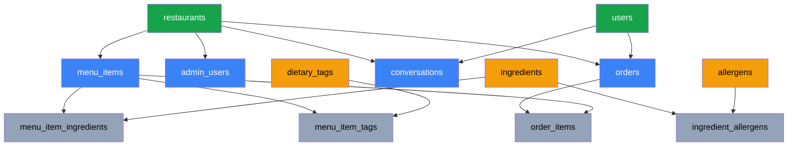
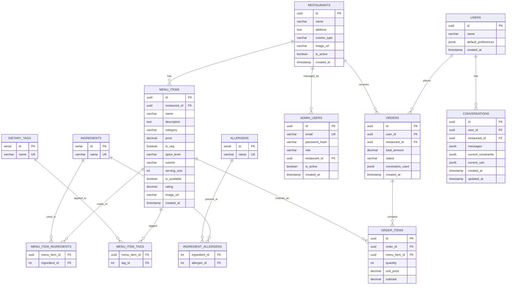

# SmartDiner

AI-powered restaurant assistant that guarantees allergen safety, budget compliance, and dietary adherence through a governed architecture.

## Database Architecture

The SmartDiner backend relies on a PostgreSQL database managed by SQLAlchemy 2.0 (asyncio) and Alembic for migrations. 

**Key Design Decisions:**
- **UUIDv7:** All primary keys (except static lookups) use time-sorted `UUIDv7` (via the `uuid6` python package) to prevent B-Tree index fragmentation and ensure high-performance inserts.
- **Strict Data Integrity:** Database-level `CHECK` constraints are utilized heavily to ensure the deterministic solver always receives clean, valid data (e.g., valid categories, positive serving sizes, and Role-Based Access Control scoped strictly to restaurants).
- **JSONB for Evolving State:** User preferences, chat histories, constraints, and carts are stored in `JSONB` columns to allow rapid schema iteration without frequent migrations.

---

## Table Dependency & Creation Order

To respect Foreign Key constraints, tables are strictly ordered from independent master tables down to join tables.

1. **Independent Entities (No Foreign Keys):**
   - `restaurants`
   - `users`
   - `allergens` (Standalone lookup)
   - `dietary_tags` (Standalone lookup)
   - `ingredients` (Standalone lookup)
2. **First-Level Dependencies:**
   - `menu_items` (Depends on `restaurants`)
   - `admin_users` (Depends on `restaurants`)
   - `conversations` (Depends on `users`, `restaurants`)
   - `orders` (Depends on `users`, `restaurants`)
   - `ingredient_allergens` (Depends on `ingredients`, `allergens`)
3. **Join Tables & Line Items (Final Layer):**
   - `menu_item_ingredients` (Depends on `menu_items`, `ingredients`)
   - `menu_item_tags` (Depends on `menu_items`, `dietary_tags`)
   - `order_items` (Depends on `orders`, `menu_items`)

### Entity Relationship Diagram (ERD)

---

## Detailed Schema Definitions

### 1. `restaurants`
The top-level entity that scopes menus, orders, and admin users.
- `id` (UUIDv7, PK)
- `name` (String 150, NOT NULL)
- `address` (Text, Nullable)
- `cuisine_type` (String 100, Nullable) — Constrained via `CHECK IN` to standard cuisines.
- `image_url` (Text, Nullable)
- `is_active` (Boolean, default: True) — Used for soft-deletions to preserve historical order data.
- `created_at` (TIMESTAMPTZ)
- **Relationships:** `menu_items`, `admin_users`, `orders`

### 2. `users`
End-users interacting with the AI assistant.
- `id` (UUIDv7, PK)
- `name` (String 100, Nullable)
- `default_preferences` (JSONB, default: `{}`) — Stores default dietary needs, allergens, and spice tolerance.
- `created_at` (TIMESTAMPTZ)
- **Relationships:** `orders`, `conversations`

### 3. `admin_users`
Platform administrators and restaurant managers. Enforces strict RBAC via a table-level check constraint.
- `id` (UUIDv7, PK)
- `email` (String 150, UNIQUE, NOT NULL)
- `password_hash` (Text, NOT NULL)
- `role` (String 30, NOT NULL) — Must be `'PLATFORM_ADMIN'` or `'RESTAURANT_ADMIN'`.
- `restaurant_id` (UUID, FK -> `restaurants.id`, Nullable)
- `is_active` (Boolean, default: True)
- `created_at` (TIMESTAMPTZ)
- **Constraints:** `ck_admin_scope` ensures `PLATFORM_ADMIN` has `restaurant_id IS NULL`, while `RESTAURANT_ADMIN` has `restaurant_id IS NOT NULL`.

### 4. `menu_items`
Individual dishes scoped to a specific restaurant.
- `id` (UUIDv7, PK)
- `restaurant_id` (UUID, FK -> `restaurants.id`, ON DELETE CASCADE, NOT NULL)
- `name` (String 150, NOT NULL)
- `description` (Text, Nullable)
- `category` (String 50, NOT NULL) — `CHECK IN ('Starter', 'Main Course', 'Bread', 'Rice', 'Beverage', 'Dessert', 'Side', 'Combo', 'Fast Food')`
- `price` (Numeric(10,2), NOT NULL) — `CHECK (price >= 0)`. Uses Numeric instead of Float to prevent rounding errors.
- `is_veg` (Boolean, default: False)
- `spice_level` (String 20, NOT NULL) — `CHECK IN ('None', 'Low', 'Medium', 'High', 'Extreme')`
- `cuisine` (String 50, NOT NULL) — Constrained to standard types (e.g. 'North Indian', 'Fast Food', 'Beverages').
- `serving_size` (Integer, default: 1, NOT NULL) — `CHECK (serving_size > 0)`
- `is_available` (Boolean, default: True)
- `rating` (Numeric(2,1), default: 4.0) — `CHECK (rating BETWEEN 0 AND 5)`
- `image_url` (Text, Nullable)
- `created_at` (TIMESTAMPTZ)
- **Indexes:** 
  - `idx_menu_filter`: Composite index on `(restaurant_id, is_available, is_veg, spice_level, price)`. This is the critical index used by the deterministic filter engine.
- **Relationships:** `restaurant`, `ingredients`, `dietary_tags`, `order_items`

### 5. `ingredients`, `allergens` & Join Tables
Master lookup tables that define what a dish is made of, and which allergens those ingredients contain. This enforces a single source of truth for allergens.
- **`ingredients`**: `id` (Integer, PK), `name` (String 100, UNIQUE, NOT NULL).
- **`allergens`**: `id` (Integer, PK), `name` (String 50, UNIQUE, NOT NULL).
- **`menu_item_ingredients` (Join)**: `menu_item_id` (FK), `ingredient_id` (FK).
- **`ingredient_allergens` (Join)**: `ingredient_id` (FK), `allergen_id` (FK).

### 6. `dietary_tags` & `menu_item_tags`
Master lookup table for dietary classifications (e.g. "Vegan", "Jain"), mapped to menu items via a Many-to-Many join table. 
- Structurally identical to the Allergen tables.

### 7. `conversations`
Maintains the state of an ongoing chat session, acting as the memory bank for the LLM.
- `id` (UUIDv7, PK)
- `user_id` (UUID, FK -> `users.id`, Nullable)
- `restaurant_id` (UUID, FK -> `restaurants.id`, Nullable)
- `messages` (JSONB, default: `[]`) — Raw chat history for context.
- `current_constraints` (JSONB, default: `{}`) — Accumulated rules (e.g., budget, people count).
- `current_cart` (JSONB, default: `[]`) — Server-side cart persistence (array of `{item_id, quantity, unit_price}`).
- `created_at`, `updated_at` (TIMESTAMPTZ)

### 8. `orders` & `order_items`
Records completed transactions and provides an audit trail for the deterministic solver.
- **`orders`**:
  - `id` (UUIDv7, PK)
  - `user_id` (UUID, FK -> `users.id`, Nullable)
  - `restaurant_id` (UUID, FK -> `restaurants.id`, NOT NULL)
  - `total_amount` (Numeric(10,2), NOT NULL)
  - `status` (String 20, default: 'pending') — `CHECK IN ('pending', 'confirmed', 'preparing', 'ready', 'delivered', 'cancelled')`
  - `constraints_used` (JSONB, Nullable) — **Audit Trail**: Stores the exact constraints outputted by the LLM (e.g. `{"budget": 1000}`) so admins can verify if the solver accurately respected the user's intent.
- **`order_items`**:
  - `id` (UUIDv7, PK)
  - `order_id` (UUID, FK -> `orders.id`, ON DELETE CASCADE, NOT NULL)
  - `menu_item_id` (UUID, FK -> `menu_items.id`, NOT NULL)
  - `quantity` (Integer, NOT NULL) — `CHECK (quantity > 0)`
  - `unit_price` (Numeric(10,2), NOT NULL)
  - `subtotal` (Numeric(10,2), NOT NULL)
