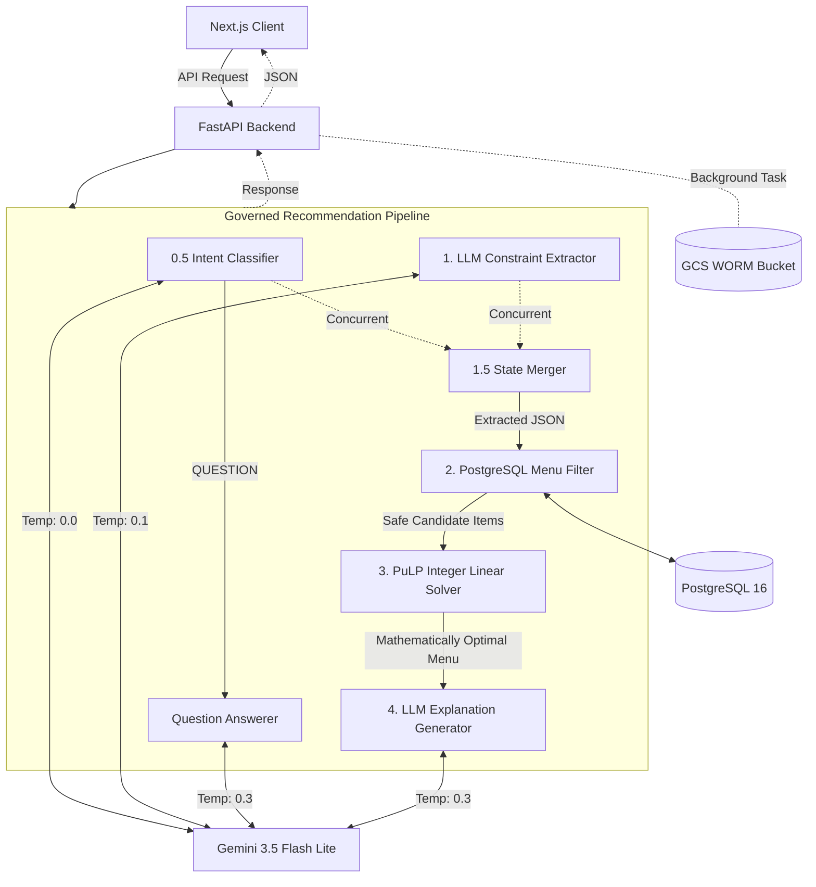
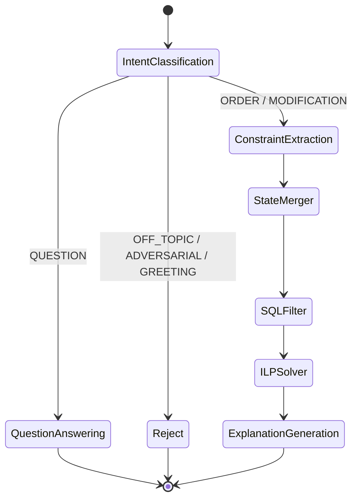

# SmartDiner Architecture

SmartDiner employs a "Governed AI Pipeline" architecture. Instead of relying on a single Large Language Model (LLM) to perform reasoning, math, and data retrieval simultaneously (which often leads to hallucinated prices, ignored allergies, and mathematical errors), SmartDiner strictly separates concerns.

## 1. High-Level System Architecture

## 2. The Governed Pipeline

### Step 0.5 & 1: Intent Classification & Constraint Extraction (LLM)
The user's natural language input (e.g., "Food for 3, no nuts, budget ₹2000" or "What did you change?") is passed to two concurrent Gemini 3.5 Flash Lite calls:
1. **Intent Classifier:** Determines if the message is an `ORDER`, `MODIFICATION`, `QUESTION`, `GREETING`, `OFF_TOPIC`, or `ADVERSARIAL`. 
2. **Constraint Extractor:** Simultaneously extracts structured constraints from the message, maintaining awareness of the `Current Draft Cart` to handle specific dish swaps or removals.

*Short-Circuit:* If the intent is `QUESTION`, the pipeline bypasses the math solver entirely and routes to a specific Q&A prompt to answer the user based on their current cart without modifying it. If the intent is malicious or off-topic, it rejects the request instantly.

### Step 1.5: State Merging (Deterministic Python)
The delta constraints extracted in Step 1 are merged securely with the existing conversation state. List fields like `excluded_dishes` or `preferred_categories` override the delta, while numeric limits like `max_budget` update the ongoing state constraints.

### Step 2: Deterministic Menu Filtering (SQL)
The merged constraints are passed to the database layer. SQLAlchemy dynamically builds a query to fetch only the menu items that mathematically and factually satisfy the hard limits.
- **Action:** Filters out items exceeding `max_spice_level`, costing more than the entire `max_budget`, or containing any `excluded_allergens`. (Note: Category preferences are *not* strict filters here to prevent destroying existing cart items).
- **Performance:** Employs an in-memory TTL caching layer to bypass heavy multi-table DB joins for frequently accessed menus, eliminating N+1 query latency.
- **Safety:** Allergens are traced deep into the relationship tree (`MenuItem -> Ingredient -> Allergen`), guaranteeing absolute dietary safety without relying on LLM reasoning.

### Step 3: ILP Optimization (PuLP Math Solver)
The filtered "safe" candidate items are passed to an Integer Linear Programming (ILP) solver. 
- **Objective:** Maximize `(Item Rating × Serving Size)` with category diversity bonuses (+5.0 per unique category activated).
- **Constraints:** 
  - Total Cost ≤ `max_budget`
  - Total Servings ≥ `people_count`
  - Vegetarian/Vegan/Non-Veg Servings minimums based on headcount
  - Must NOT select any items in `excluded_dishes` (qty = 0)
  - Must include at least 1 item from requested `preferred_categories`
  - **Category Minimum Counts:** Enforces $\sum_{i \in \text{cat}} x_i \ge \text{target\_min}$ for categories specified in `category_min_counts` (e.g. 2 breads, 2 beverages).
  - **Specific Dish Quantities:** Enforces $\sum x_{\text{dish}} \ge \text{req\_qty}$ for items specified in `dish_quantities`.
  - **Universal Course Balance (`SoftMainReq`):** Penalizes absent main courses by -30.0 points to guarantee realistic meal structure across all party sizes.
  - **Anti-Monopoly Caps:** Restricts beverages, sides, and desserts unless explicitly overridden by user quantity requests.
  - **Dynamic Feast Ceiling:** Total Servings $\le \max(\text{people\_count} \times 4, (\text{req\_counts}) \times 2, 12)$ to prevent artificial infeasibility when diners order multi-portion extras.
- **Safety:** This step guarantees that the final menu perfectly respects the budget, feeding requirements, and contextual dish swaps/removals requested by the user. It completely eliminates the "bad math" problem inherent to autoregressive LLMs.

### Step 4: Explanation Generation (LLM)
The mathematically verified output from Step 3 is fed back into Gemini 3.5 Flash Lite alongside the original constraints.
- **Action:** Generates a friendly, 2-3 sentence summary explaining the recommendation.
- **Safety:** The system prompt strictly forbids hallucinating items, prices, or rationales outside of the injected solver context.

### Step 5: Enriched Compliance Audit Logging (Asynchronous WORM)
Once the response is generated, a FastAPI `BackgroundTask` compiles a comprehensive telemetry payload into an immutable JSON artifact uploaded to Google Cloud Storage (GCS) with Object Lock:
- **Exact SQL Executed:** Full compiled SQL string with bound parameters and query execution time (ms).
- **Cache Hit / Miss:** Status of the in-memory menu filter cache (`status`, `key`, `duration_ms`, `ttl_remaining_s`, `items_count`).
- **LLM Token Usage:** Exact `prompt_tokens`, `completion_tokens`, and `total_tokens` recorded across Intent Classification, Constraint Extraction, and Explanation Generation with latency timestamps.
- **Mathematical Solver Rationale:** Objective function value, CBC solve time (ms), count of items considered, count of items selected, and active category distribution.
- **Compliance:** Object Lock guarantees Write Once, Read Many (WORM) immutability, preventing alteration or premature deletion.

## 3. Advanced Subsystems

### 3.1. Restaurant-Agnostic Concierge & Multi-Venue Resolver
Customers can converse with the AI Concierge directly from the landing page without selecting a restaurant in advance.
1. **Direct Venue Resolution:** If the user specifies a restaurant by name (e.g., "order from Spice Garden"), the resolver performs fuzzy and case-insensitive matching to bind the session to that restaurant UUID.
2. **Cross-Restaurant Optimization:** If no restaurant is specified, the system evaluates user dish and cuisine preferences across all active restaurants, executes candidate menu filters, runs the ILP solver across the top venues, and returns ranked meal packages.
3. **Session Finalization:** The frontend renders comparison cards with a "Lock In & Order" action, allowing the diner to seamlessly lock in the chosen restaurant and continue ordering.

### 3.2. Dual-Source Admin Conversational Business Intelligence
The executive admin dashboard integrates a dedicated conversational AI engine powered by Gemini 3.5 Flash Lite:
- **Intelligent Query Classification:** Automatically classifies admin questions into `POSTGRES_METRICS` (live order volume, revenue sums, popular items), `GCS_AUDIT_LOGS` (historical solver behavior, allergen frequency trends), or `HYBRID`.
- **Strict Role-Based Access Control (RBAC):** `RESTAURANT_ADMIN` users have queries dynamically scoped to their own `restaurant_id`; `PLATFORM_ADMIN` users can query system-wide trends.
- **Source Attribution:** Responses indicate data provenance with transparent visual badges (`PostgreSQL Database`, `GCS WORM Audit Logs`).

### 3.3. Enhanced Meal Diversity & Course Balance Model
To guarantee realistic, high-quality dining packages:
- **Category Diversity Bonus:** The ILP objective function includes a +5.0 multiplier per unique category activated.
- **Soft Course Structure Penalties:** For dining groups of 3 or more, soft penalties (-10.0 for missing Starter, -10.0 for missing Main Course, -5.0 for missing Dessert/Beverage) strongly penalize unbalanced meals while maintaining mathematical feasibility under tight budgets.
- **Anti-Monopoly Caps:** Restricts staple bread and rice quantities to `ceil(people_count * 1.5)` to prevent the solver from filling budgets with repetitive carbs.

### 3.4. Dual-Tier In-Memory Caching Architecture & Centralized Constants
To eliminate redundant database operations while maintaining strict data consistency across multi-turn sessions:
- **L1 Full Catalog Cache (`MENU_CACHE`):** Defined in `backend/app/routers/menu.py` with a 300-second TTL. Prevents expensive multi-table relational joins (`Ingredient`, `Allergen`, `MenuItemIngredient`) during customer catalog browsing (`GET /api/restaurants/{id}/menu`).
- **L2 Dynamic Filter Cache (`MENU_FILTER_CACHE`):** Defined in `backend/app/services/menu_filter.py` with a synchronized 300-second TTL. Generates a deterministic hash from the restaurant ID, spice level, sorted allergen exclusions, sorted cuisines, and normalized budget. Accelerates multi-turn chat refinements by serving candidate items in under 0.2 ms.
- **Centralized System Constants:** All configuration limits, cache TTLs, dining taxonomies, and platform currency are unified in `backend/app/constants.py`:
  - `MENU_CACHE_TTL_SECONDS = 300.0`
  - `MENU_FILTER_CACHE_TTL_SECONDS = 300.0`
  - `PLATFORM_CURRENCY_CODE = "INR"`, `PLATFORM_CURRENCY_SYMBOL = "₹"`
  - `SUPPORTED_ALLERGENS`, `SPICE_ORDER`, `CUISINE_SYNONYMS`
- **Atomic Invalidation:** When restaurant administrators modify dishes in `backend/app/routers/admin_menu.py`, the system evicts both L1 (`MENU_CACHE.pop()`) and L2 (`clear_menu_filter_cache()`) entries, guaranteeing zero stale data.

### 3.5. Server-Sent Events (SSE) Streaming & Real-Time Reactivity
To eliminate monolithic request-response wait times and drastically improve perceived application latency:
- **Customer Streaming (`POST /api/chat/stream`):** Rather than blocking for 4-8 seconds while both solver optimization and LLM explanation complete sequentially, the backend emits fine-grained SSE frames:
  1. `event: status`: Broadcasts pipeline progress (`intent_and_constraints`, `resolving_restaurant`, `filtering_menu`, `optimizing_meal`, `generating_explanation`).
  2. `event: cart`: Dispatches the structured `RecommendationResult` immediately when the ILP solver completes. The client populates the order cart and calculates remaining budget instantly.
  3. `event: token`: Emits incremental explanation text chunks from `client.aio.models.generate_content_stream` (Gemini 3.5 Flash Lite).
  4. `event: done`: Dispatches complete `ChatResponse` model dump, while enqueuing GCS WORM audit logging asynchronously via `asyncio.create_task`.
- **Admin Insights Streaming (`POST /api/admin/insights/chat/stream`):** Emits status updates during dual-source classification and SQL/GCS data fetching, followed by token streaming for the executive business synthesis.

### 3.6. Generator-First Streaming Core & Modular Pipeline Architecture
To eliminate code duplication across streaming and unary response generators while preventing monolithic service functions:
- **Streaming Core as Single Source of Truth:**
  - In `backend/app/services/explanation_generator.py`, prompt building logic is extracted into pure functions (`build_explanation_context`, `build_question_answer_prompt`). The canonical generators `stream_explanation` and `stream_question_answer` perform Gemini API streaming. Non-streaming functions (`generate_explanation`, `generate_question_answer`) are thin unary adapters that drain the generator and return `(text, telemetry)`.
  - In `backend/app/services/recommendation_pipeline.py`, the core recommendation workflow is written once in `_execute_recommendation_pipeline`. `stream_chat_pipeline` formats events into SSE text frames, and `process_chat_request` drains the generator until the `done` event.
- **Modular Pipeline Decomposition:**
  The recommendation pipeline is decomposed into single-responsibility helper functions, bringing the top-level orchestrator down to ~80 lines:
  1. `_load_conversation_state`: Loads conversation history, current constraints, and restaurant context.
  2. `_resolve_restaurant_context`: Handles restaurant resolution, switching (cart reset, constraint pruning), cross-restaurant comparisons, and ambiguity handling.
  3. `_ensure_conversation`: Synchronizes conversation records in PostgreSQL.
  4. `_handle_non_recommendation_intent`: Manages `QUESTION`, `GREETING`, `OFF_TOPIC`, and `ADVERSARIAL` short-circuits.
  5. `_build_recommendation_result`: Transforms ILP output into `RecommendedItem` models, computes dietary breakdowns, and calculates remaining budget.
  6. `_save_conversation_state`: Appends messages, saves constraints and cart, and commits to database.
  7. `_dispatch_gcs_audit`: Safely enqueues asynchronous GCS WORM audit logging.

### 3.7. Multi-Turn Quantity Constraints & Read-Only Anti-Hallucination Guardrails
To support explicit portion requests while preventing conversational hallucinations:
- **Quantity-Aware Schemas (`category_min_counts`, `dish_quantities`):** Extracted constraints support explicit counts per category (e.g. `{"Bread": 2, "Beverage": 2}`) and dish (e.g. `{"Garlic Naan": 2}`). Pydantic validators seamlessly accept dictionary mapping while presenting array-of-string definitions to the Gemini API to avoid OpenAPI schema validation issues.
- **Action Directive Disambiguation:** Prompt engineering in `app/prompts/intent_classification.py` ensures that imperative update instructions (e.g. *"do those update now then"*, *"apply that change now"*) are strictly classified as `MODIFICATION`, preventing premature routing to informational Q&A.
- **Read-Only Mandate for Question Answering:** In `app/prompts/explanation.py`, `QUESTION_ANSWER_SYSTEM_PROMPT` enforces that the model cannot claim it updated the cart or changed item counts during read-only inquiries.

## 4. Technology Stack

### Frontend
- **Framework:** Next.js 15 App Router with React 19 and TypeScript
- **Styling:** Tailwind CSS + Framer Motion (glassmorphic UI, micro-animations)
- **Markdown & Icons:** React Markdown + Tailwind Typography + Lucide React
- **Streaming:** Native `fetch` with `ReadableStream` reader processing Server-Sent Events (SSE)

### Backend
- **Framework:** FastAPI (Python 3.12+)
- **Constants Layer:** `backend/app/constants.py` (Single Source of Truth)
- **Prompts Architecture:** Centralized prompt modules under `backend/app/prompts/` (`intent_classification.py`, `constraint_extraction.py`, `explanation.py`, `admin_insights.py`, `llm_judge.py`)
- **Database:** PostgreSQL 16 (via asyncpg with UUIDv7 primary keys)
- **ORM:** SQLAlchemy 2.0 (Async) + Alembic for migrations
- **AI/Math:** `google-genai` (Gemini 3.5 Flash Lite) + `PuLP` (CBC Mixed-Integer Linear Programming Solver)
- **Compliance Storage:** Google Cloud Storage (`google-cloud-storage`) with Object Lock (WORM)
- **Authentication:** JWT customer/admin login with role claims; password hashing uses Passlib with `bcrypt==4.0.1`

### HTTP Surface
The backend provides a comprehensive REST API encompassing restaurant/menu browsing, AI-governed chat and state retrieval, customer registration, admin authentication, admin metrics, admin conversational insights (`POST /api/admin/insights/chat`), and full audit conversation listing.

## 5. Alternative Architectures Considered
- **Pure LLM Agent (e.g., LangChain/ReAct):** Initially considered using a ReAct loop where the LLM writes SQL queries. **Rejected** due to high latency, prompt injection vulnerabilities, and mathematical unreliability when summing up budgets.
- **Vector Database (RAG):** Considered for menu searching. **Rejected** because relational SQL filtering is overwhelmingly superior for exact-match exclusion (like deadly allergies) and numerical bounds (budget thresholds). Semantic search provides no value for strict dietary adherence.
