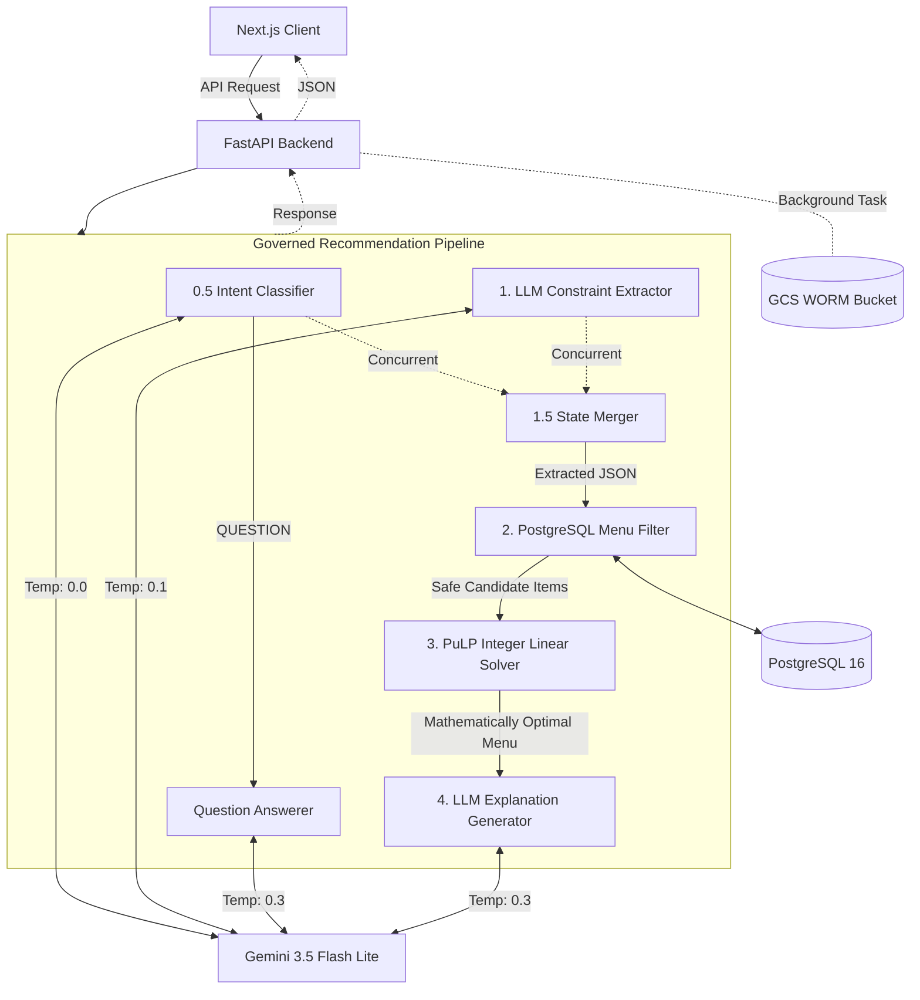
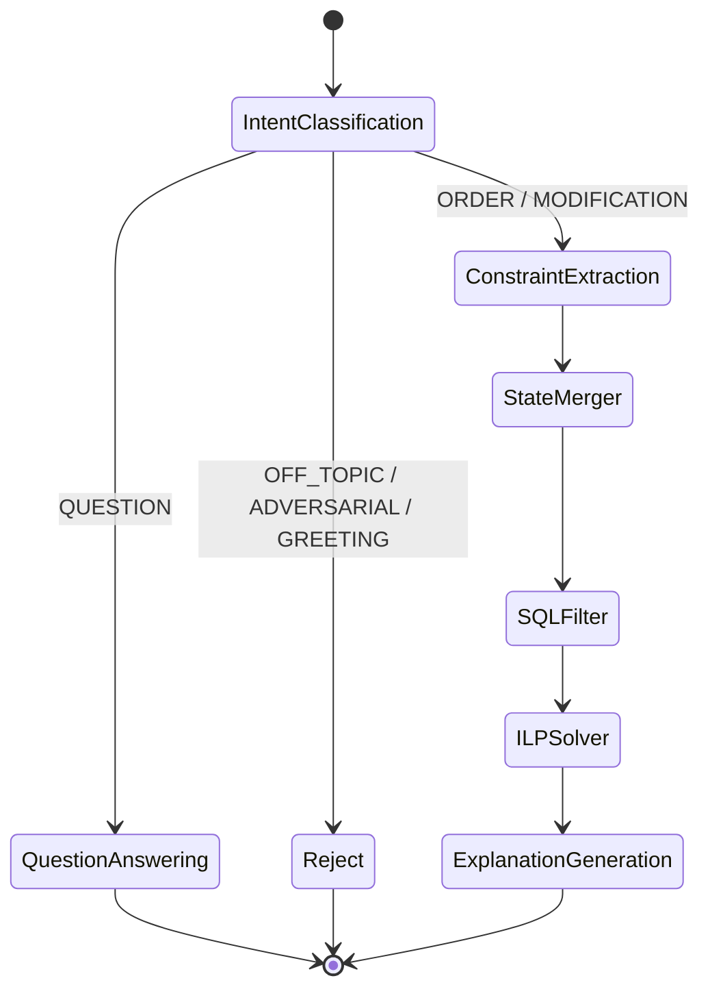

# SmartDiner Architecture

SmartDiner employs a "Governed AI Pipeline" architecture. Instead of relying on a single Large Language Model (LLM) to perform reasoning, math, and data retrieval simultaneously (which often leads to hallucinated prices, ignored allergies, and mathematical errors), SmartDiner strictly separates concerns.

## 1. High-Level System Architecture

## 2. The Governed Pipeline

### Step 0.5 & 1: Intent Classification & Constraint Extraction (LLM)
The user's natural language input (e.g., "Food for 3, no nuts, budget ₹2000" or "What did you change?") is passed to two concurrent Gemini 3.5 Flash Lite calls:
1. **Intent Classifier:** Determines if the message is an `ORDER`, `MODIFICATION`, `QUESTION`, `GREETING`, `OFF_TOPIC`, or `ADVERSARIAL`. 
2. **Constraint Extractor:** Simultaneously extracts structured constraints from the message, maintaining awareness of the `Current Draft Cart` to handle specific dish swaps or removals.

*Short-Circuit:* If the intent is `QUESTION`, the pipeline bypasses the math solver entirely and routes to a specific Q&A prompt to answer the user based on their current cart without modifying it. If the intent is malicious or off-topic, it rejects the request instantly.

### Step 1.5: State Merging (Deterministic Python)
The delta constraints extracted in Step 1 are merged securely with the existing conversation state. List fields like `excluded_dishes` or `preferred_categories` override the delta, while numeric limits like `max_budget` update the ongoing state constraints.

### Step 2: Deterministic Menu Filtering (SQL)
The merged constraints are passed to the database layer. SQLAlchemy dynamically builds a query to fetch only the menu items that mathematically and factually satisfy the hard limits.
- **Action:** Filters out items exceeding `max_spice_level`, costing more than the entire `max_budget`, or containing any `excluded_allergens`. (Note: Category preferences are *not* strict filters here to prevent destroying existing cart items).
- **Performance:** Employs an in-memory TTL caching layer to bypass heavy multi-table DB joins for frequently accessed menus, eliminating N+1 query latency.
- **Safety:** Allergens are traced deep into the relationship tree (`MenuItem -> Ingredient -> Allergen`), guaranteeing absolute dietary safety without relying on LLM reasoning.

### Step 3: ILP Optimization (PuLP Math Solver)
The filtered "safe" candidate items are passed to an Integer Linear Programming (ILP) solver. 
- **Objective:** Maximize `(Item Rating × Serving Size)` to provide the best value.
- **Constraints:** 
  - Total Cost ≤ `max_budget`
  - Total Servings ≥ `people_count`
  - Vegetarian/Vegan/Non-Veg Servings minimums based on headcount
  - Must NOT select any items in `excluded_dishes` (qty = 0)
  - Must include at least 1 item from requested `preferred_categories`
  - Total Servings ≤ `people_count * 4` (Reasonable Feast Limit)
- **Safety:** This step guarantees that the final menu perfectly respects the budget, feeding requirements, and contextual dish swaps/removals requested by the user. It completely eliminates the "bad math" problem inherent to autoregressive LLMs.

### Step 4: Explanation Generation (LLM)
The mathematically verified output from Step 3 is fed back into Gemini 3.5 Flash Lite alongside the original constraints.
- **Action:** Generates a friendly, 2-3 sentence summary explaining the recommendation.
- **Safety:** The system prompt strictly forbids hallucinating items, prices, or rationales outside of the injected solver context.

### Step 5: Compliance Audit Logging (Asynchronous)
Once the response is generated, a background task compiles the user's constraints, the math solver's output, and the LLM's explanation into a single structured JSON payload.
- **Action:** Uploads the payload to Google Cloud Storage (GCS).
- **Compliance:** The GCS bucket is configured with **Object Lock** to enforce WORM (Write Once, Read Many). This guarantees cryptographically that the AI's decision trail cannot be deleted or modified for the duration of the retention policy (e.g., 7 days or 1 year).

## 3. Technology Stack

### Frontend
- **Framework:** Next.js App Router with TypeScript
- **Styling:** Tailwind CSS + Framer Motion (glassmorphic UI, micro-animations)
- **State Management:** React Hooks and URL search parameters; API access uses `NEXT_PUBLIC_API_URL`.

### Backend
- **Framework:** FastAPI (Python 3.12+)
- **Database:** PostgreSQL 16 (via asyncpg)
- **ORM:** SQLAlchemy 2.0 + Alembic for migrations
- **AI/Math:** `google-genai` (Gemini API) + `PuLP` (CBC Solver)
- **Compliance Storage:** Google Cloud Storage (`google-cloud-storage`) with Object Lock (WORM).
- **Authentication:** JWT customer/admin login with role claims; password hashing uses Passlib with `bcrypt==4.0.1`.

### HTTP Surface
The backend provides a comprehensive REST API encompassing restaurant/menu browsing, AI-governed chat and state retrieval, customer registration, admin authentication, admin metrics, and full audit conversation listing. This API acts as the bridge between the React frontend and the governed pipeline.

## 4. Alternative Architectures Considered
- **Pure LLM Agent (e.g., LangChain/ReAct):** Initially considered using a ReAct loop where the LLM writes SQL queries. **Rejected** due to high latency, prompt injection vulnerabilities, and mathematical unreliability when summing up budgets.
- **Vector Database (RAG):** Considered for menu searching. **Rejected** because relational SQL filtering is overwhelmingly superior for exact-match exclusion (like deadly allergies) and numerical bounds (budget thresholds). Semantic search provides no value for strict dietary adherence.
