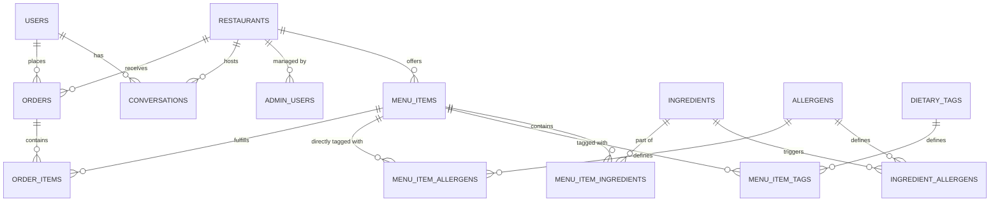

# Database Architecture & Schema Design

SmartDiner relies on PostgreSQL 16. The database is strictly normalized to act as a deterministic safeguard against LLM hallucinations, particularly regarding budget validation and allergen safety.

## 1. Entity Relationship Diagram (ERD)

## 2. Core Tables and Rationale

### 2.1. Restaurants and Users
- **`restaurants`**: The master tenant table. Every operational entity (menus, admins, conversations) must scope to a specific `restaurant_id` via a Foreign Key to ensure strict multi-tenant data isolation.
- **`users`**: Represents the customers interacting with the concierge.
- **`admin_users`**: Represents restaurant staff. Secured with a hashed `password_hash` column; platform admins may have no restaurant while restaurant admins are scoped to one restaurant.

### 2.2. Menu & Safety Taxonomy
- **`menu_items`**: Contains absolute facts like `price`, `dietary_preference` ('Vegetarian', 'Vegan', 'Non-Vegetarian'), `spice_level`, and `serving_size`. These use constrained strings and numerics rather than SQL enum types.
- **`ingredients` & `allergens`**: A critical decoupling. By mapping `allergens` directly to `ingredients` (via `ingredient_allergens`) rather than directly to `menu_items`, we create a robust single source of truth. If "Peanut Oil" is flagged with the "Peanut" allergen, any dish using Peanut Oil is automatically excluded by the solver without manual tag duplication. We also maintain a **`menu_item_allergens`** join table for edge-cases where an admin wants to explicitly manually tag an allergen onto a dish (e.g., cross-contamination warnings).

### 2.3. Stateful Records
- **`conversations`**: Utilizes PostgreSQL's `JSONB` column type for `messages` and `current_constraints`. This allows the schema to dynamically absorb evolving LLM interactions without requiring constant Alembic schema migrations.
- **`orders` & `order_items`**: Immutable records capturing a finalized solver recommendation.

## 3. Key Design Decisions

### UUIDv7 for Primary Keys
Instead of auto-incrementing integers (which can leak business volume metrics) or standard UUIDv4 (which fragments B-Tree indexes on massive inserts), SmartDiner strictly utilizes **UUIDv7** (time-sorted UUIDs) for all primary keys (via the `uuid6` python library). This ensures secure, unguessable IDs while maintaining the insertion performance of sequential integers.

### Aggressive CHECK Constraints
Data integrity is prioritized heavily at the schema layer. Examples include:
- `CHECK (price >= 0)` on `menu_items`
- `CHECK (quantity > 0)` on `order_items`
This prevents the ILP math solver from attempting to maximize "negative prices" and returning impossible mathematical structures.

### The SQLAlchemy Filter Abstraction
The database is queried via asynchronous SQLAlchemy 2.0 sessions (`asyncpg`). The menu filter constructs dynamic `NOT EXISTS` subqueries to traverse the `MenuItem -> Ingredient -> Allergen` graph. If an extracted constraint requests `no dairy`, the SQL engine acts as the ultimate truth source, physically excluding any item matching the Dairy trace before the data ever reaches the math engine.
