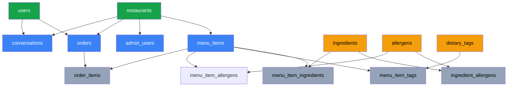
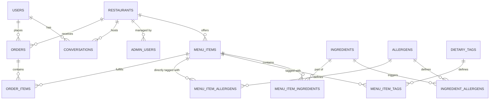

# Database Architecture & Schema Design

SmartDiner relies on PostgreSQL 16. The database is strictly normalized to act as a deterministic safeguard against LLM hallucinations, particularly regarding budget validation and allergen safety.

## 1. Table Dependency & Creation Order

To respect Foreign Key constraints, tables are strictly ordered from independent master tables down to join tables.

1. **Independent Entities:** `restaurants`, `users`, `allergens`, `dietary_tags`, `ingredients`
2. **First-Level Dependencies:** `menu_items`, `admin_users`, `conversations`, `orders`, `ingredient_allergens`
3. **Join Tables & Line Items:** `menu_item_ingredients`, `menu_item_tags`, `menu_item_allergens`, `order_items`

## 2. Entity Relationship Diagram (ERD)

## 2. Core Tables and Rationale

### 2.1. Restaurants and Users
- **`restaurants`**: The master tenant table. Every operational entity (menus, admins, conversations) must scope to a specific `restaurant_id` via a Foreign Key to ensure strict multi-tenant data isolation.
- **`users`**: Represents the customers interacting with the concierge.
- **`admin_users`**: Represents restaurant staff. Secured with a hashed `password_hash` column; platform admins may have no restaurant while restaurant admins are scoped to one restaurant.

### 2.2. Menu & Safety Taxonomy
- **`menu_items`**: Contains absolute facts like `price`, `dietary_preference` ('Vegetarian', 'Vegan', 'Non-Vegetarian'), `spice_level`, and `serving_size`. These use constrained strings and numerics rather than SQL enum types.
- **`ingredients` & `allergens`**: A critical decoupling. By mapping `allergens` directly to `ingredients` (via `ingredient_allergens`) rather than directly to `menu_items`, we create a robust single source of truth. If "Peanut Oil" is flagged with the "Peanut" allergen, any dish using Peanut Oil is automatically excluded by the solver without manual tag duplication. We also maintain a **`menu_item_allergens`** join table for edge-cases where an admin wants to explicitly manually tag an allergen onto a dish (e.g., cross-contamination warnings).

### 2.3. Stateful Records
- **`conversations`**: Utilizes PostgreSQL's `JSONB` column type for `messages` and `current_constraints`. This allows the schema to dynamically absorb evolving LLM interactions without requiring constant Alembic schema migrations.
- **`orders` & `order_items`**: Immutable records capturing a finalized solver recommendation.

## 3. Key Design Decisions

### UUIDv7 for Primary Keys
Instead of auto-incrementing integers (which can leak business volume metrics) or standard UUIDv4 (which fragments B-Tree indexes on massive inserts), SmartDiner strictly utilizes **UUIDv7** (time-sorted UUIDs) for all primary keys (via the `uuid6` python library). This ensures secure, unguessable IDs while maintaining the insertion performance of sequential integers.

### Aggressive CHECK Constraints
Data integrity is prioritized heavily at the schema layer. Examples include:
- `CHECK (price >= 0)` on `menu_items`
- `CHECK (quantity > 0)` on `order_items`
This prevents the ILP math solver from attempting to maximize "negative prices" and returning impossible mathematical structures.

### The SQLAlchemy Filter Abstraction
The database is queried via asynchronous SQLAlchemy 2.0 sessions (`asyncpg`). The menu filter constructs dynamic `NOT EXISTS` subqueries to traverse the `MenuItem -> Ingredient -> Allergen` graph. If an extracted constraint requests `no dairy`, the SQL engine acts as the ultimate truth source, physically excluding any item matching the Dairy trace before the data ever reaches the math engine.

## Detailed Schema Definitions

### 1. `restaurants`
The top-level entity that scopes menus, orders, and admin users.
- `id` (UUIDv7, PK)
- `name` (String 150, NOT NULL)
- `address` (Text, Nullable)
- `cuisine_type` (String 100, Nullable) — Constrained via `CHECK IN` to standard cuisines.
- `image_url` (Text, Nullable)
- `is_active` (Boolean, default: True) — Used for soft-deletions to preserve historical order data.
- `created_at` (TIMESTAMPTZ)
- **Relationships:** `menu_items`, `admin_users`, `orders`

### 2. `users`
End-users interacting with the AI assistant.
- `id` (UUIDv7, PK)
- `name` (String 100, Nullable)
- `default_preferences` (JSONB, default: `{}`) — Stores default dietary needs, allergens, and spice tolerance.
- `created_at` (TIMESTAMPTZ)
- **Relationships:** `orders`, `conversations`

### 3. `admin_users`
Platform administrators and restaurant managers. Enforces strict RBAC via a table-level check constraint.
- `id` (UUIDv7, PK)
- `email` (String 150, UNIQUE, NOT NULL)
- `password_hash` (Text, NOT NULL)
- `role` (String 30, NOT NULL) — Must be `'PLATFORM_ADMIN'` or `'RESTAURANT_ADMIN'`.
- `restaurant_id` (UUID, FK -> `restaurants.id`, Nullable)
- `is_active` (Boolean, default: True)
- `created_at` (TIMESTAMPTZ)
- **Constraints:** `ck_admin_scope` ensures `PLATFORM_ADMIN` has `restaurant_id IS NULL`, while `RESTAURANT_ADMIN` has `restaurant_id IS NOT NULL`.

### 4. `menu_items`
Individual dishes scoped to a specific restaurant.
- `id` (UUIDv7, PK)
- `restaurant_id` (UUID, FK -> `restaurants.id`, ON DELETE CASCADE, NOT NULL)
- `name` (String 150, NOT NULL)
- `description` (Text, Nullable)
- `category` (String 50, NOT NULL) — `CHECK IN ('Starter', 'Main Course', 'Bread', 'Rice', 'Beverage', 'Dessert', 'Side', 'Combo', 'Fast Food')`
- `price` (Numeric(10,2), NOT NULL) — `CHECK (price >= 0)`. Uses Numeric instead of Float to prevent rounding errors.
- `dietary_preference` (String 30, NOT NULL) — `CHECK IN ('Vegetarian', 'Vegan', 'Non-Vegetarian')`
- `spice_level` (String 20, NOT NULL) — `CHECK IN ('None', 'Low', 'Medium', 'High', 'Extreme')`
- `cuisine` (String 50, NOT NULL) — Constrained to standard types (e.g. 'North Indian', 'Fast Food', 'Beverages').
- `serving_size` (Integer, default: 1, NOT NULL) — `CHECK (serving_size > 0)`
- `is_available` (Boolean, default: True)
- `rating` (Numeric(2,1), default: 4.0) — `CHECK (rating BETWEEN 0 AND 5)`
- `image_url` (Text, Nullable)
- `created_at` (TIMESTAMPTZ)
- **Indexes:** 
  - `idx_menu_filter`: Composite index on `(restaurant_id, is_available, dietary_preference, spice_level, price)`. This is the critical index used by the deterministic filter engine.
- **Relationships:** `restaurant`, `ingredients`, `dietary_tags`, `menu_item_allergens`, `order_items`

### 5. `ingredients`, `allergens` & Join Tables
Master lookup tables that define what a dish is made of, and which allergens those ingredients contain. This enforces a single source of truth for allergens.
- **`ingredients`**: `id` (Integer, PK), `name` (String 100, UNIQUE, NOT NULL).
- **`allergens`**: `id` (Integer, PK), `name` (String 50, UNIQUE, NOT NULL).
- **`menu_item_ingredients` (Join)**: `menu_item_id` (FK), `ingredient_id` (FK).
- **`ingredient_allergens` (Join)**: `ingredient_id` (FK), `allergen_id` (FK).

### 6. `dietary_tags` & `menu_item_tags`
Master lookup table for dietary classifications (e.g. "Vegan", "Jain"), mapped to menu items via a Many-to-Many join table. 
- Structurally identical to the Allergen tables.

### 7. `conversations`
Maintains the state of an ongoing chat session, acting as the memory bank for the LLM.
- `id` (UUIDv7, PK)
- `user_id` (UUID, FK -> `users.id`, Nullable)
- `restaurant_id` (UUID, FK -> `restaurants.id`, Nullable)
- `messages` (JSONB, default: `[]`) — Raw chat history for context.
- `current_constraints` (JSONB, default: `{}`) — Accumulated rules (e.g., budget, people count).
- `current_cart` (JSONB, default: `[]`) — Server-side cart persistence (array of `{item_id, quantity, unit_price}`).
- `created_at`, `updated_at` (TIMESTAMPTZ)

### 8. `orders` & `order_items`
Records completed transactions and provides an audit trail for the deterministic solver.
- **`orders`**:
  - `id` (UUIDv7, PK)
  - `user_id` (UUID, FK -> `users.id`, Nullable)
  - `restaurant_id` (UUID, FK -> `restaurants.id`, NOT NULL)
  - `total_amount` (Numeric(10,2), NOT NULL)
  - `status` (String 20, default: 'pending') — `CHECK IN ('pending', 'confirmed', 'preparing', 'ready', 'delivered', 'cancelled')`
  - `constraints_used` (JSONB, Nullable) — **Audit Trail**: Stores the exact constraints outputted by the LLM (e.g. `{"budget": 1000}`) so admins can verify if the solver accurately respected the user's intent.
- **`order_items`**:
  - `id` (UUIDv7, PK)
  - `order_id` (UUID, FK -> `orders.id`, ON DELETE CASCADE, NOT NULL)
  - `menu_item_id` (UUID, FK -> `menu_items.id`, NOT NULL)
  - `quantity` (Integer, NOT NULL) — `CHECK (quantity > 0)`
  - `unit_price` (Numeric(10,2), NOT NULL)
  - `subtotal` (Numeric(10,2), NOT NULL)

