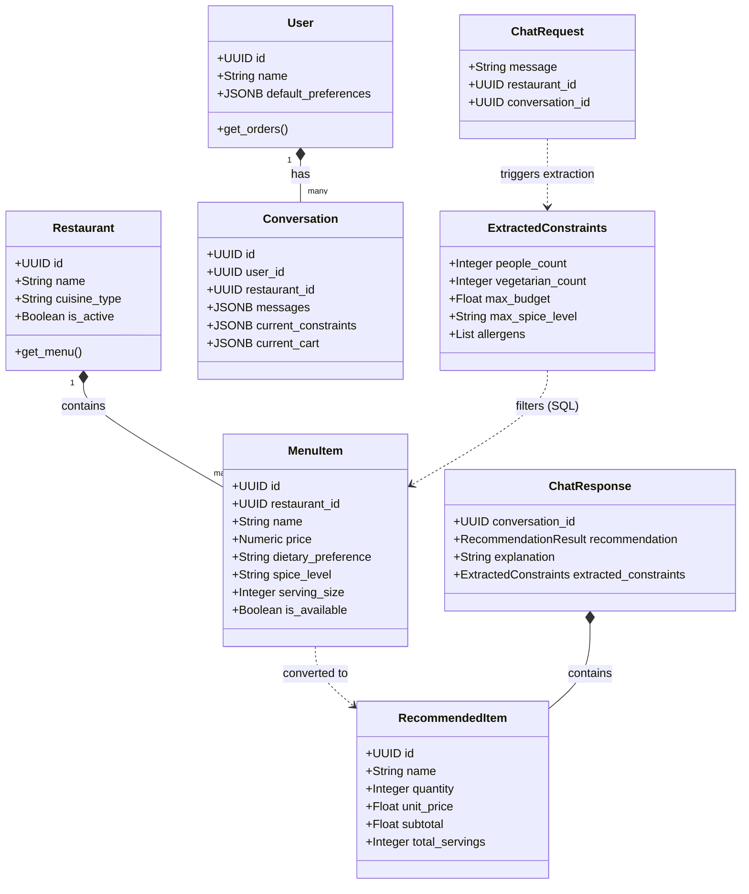
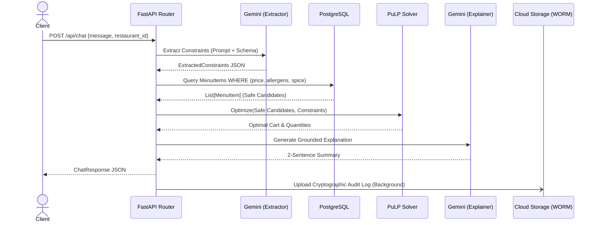

# SmartDiner UML Diagrams

While the ER Diagram covers the relational database structure, these UML Class and Sequence diagrams illustrate the object-oriented structure of the Python backend (SQLAlchemy Models and Pydantic Schemas) and the execution flow of the governed AI pipeline.

## 1. Class Diagram (Core Backend Models & Schemas)

This diagram shows how the FastAPI Pydantic schemas (for data validation) map and relate to the internal SQLAlchemy ORM models.

## 2. Sequence Diagram (Chat Execution Flow)

This sequence diagram illustrates the strict 4-step pipeline that prevents LLM hallucinations.

