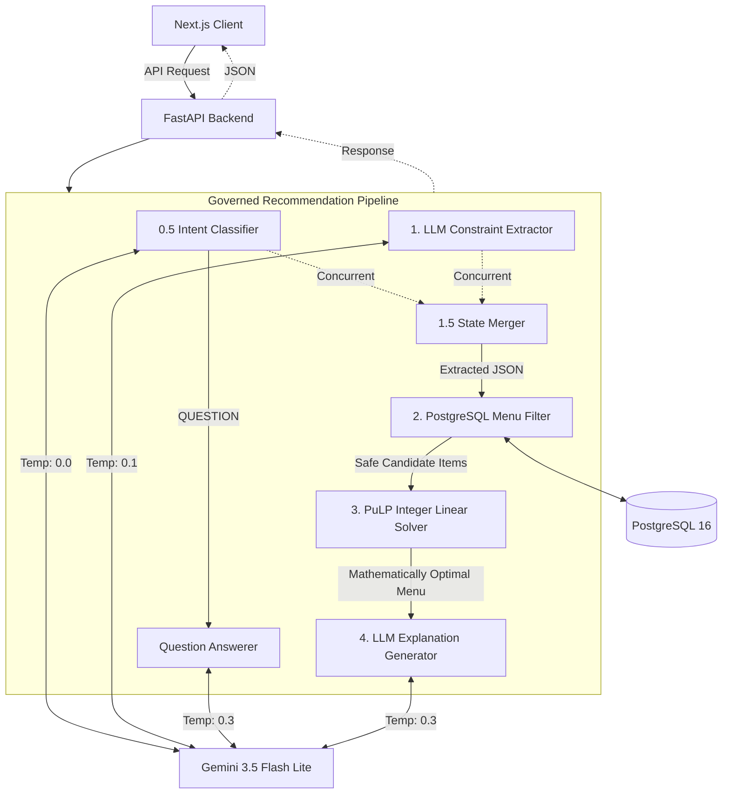
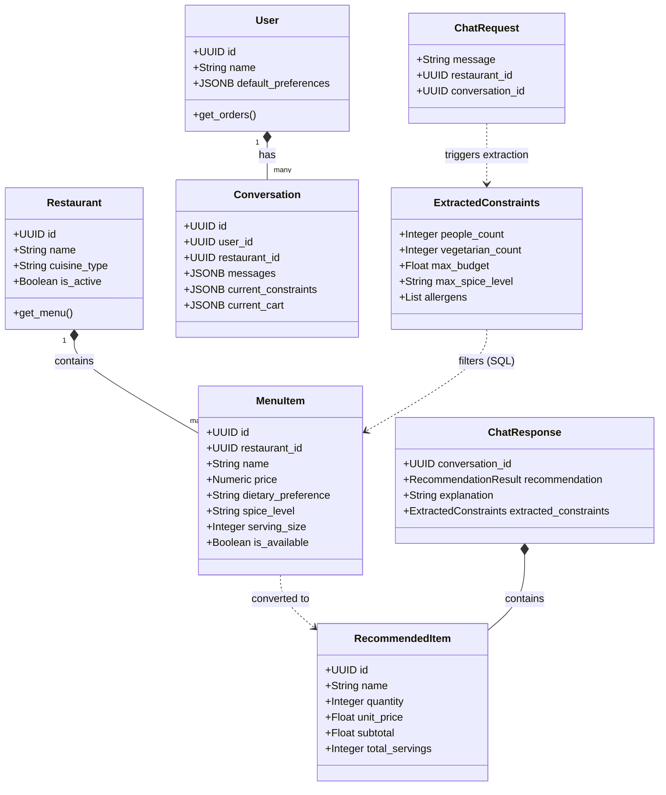
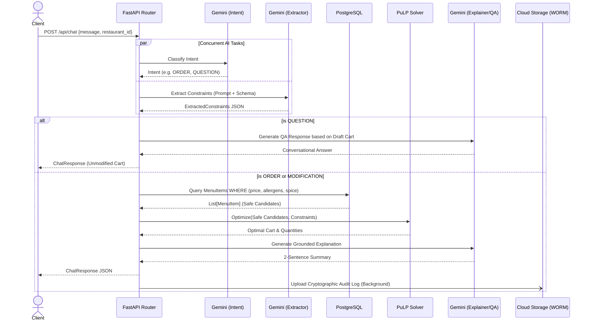

# SmartDiner UML Diagrams

While the ER Diagram covers the relational database structure, these UML Class and Sequence diagrams illustrate the object-oriented structure of the Python backend (SQLAlchemy Models and Pydantic Schemas) and the execution flow of the governed AI pipeline.

## 1. Overall System Architecture & Separation of Concerns

This flowchart outlines the high-level architecture of the Governed Recommendation Pipeline. Note how the **Gemini 3.5 Flash Lite** model is specifically orchestrated across multiple independent tasks (Intent Classification, Constraint Extraction, Question Answering, and Explanation).

**Why is the `QUESTION` intent separated?**
By isolating conversational questions (e.g., "What did you change?") from the main constraint extraction flow, we can short-circuit the pipeline. This bypasses the heavy SQL filtering and ILP math solver entirely, providing a much faster response time and guaranteeing that the user's ongoing draft cart is not accidentally wiped out or modified by the solver when they are simply asking for clarification.

## 2. Class Diagram (Core Backend Models & Schemas)

This diagram shows how the FastAPI Pydantic schemas (for data validation) map and relate to the internal SQLAlchemy ORM models.

## 3. Sequence Diagram (Chat Execution Flow)

This sequence diagram illustrates the governed AI pipeline, showing the new concurrent classification/extraction and short-circuit logic for conversational questions.

