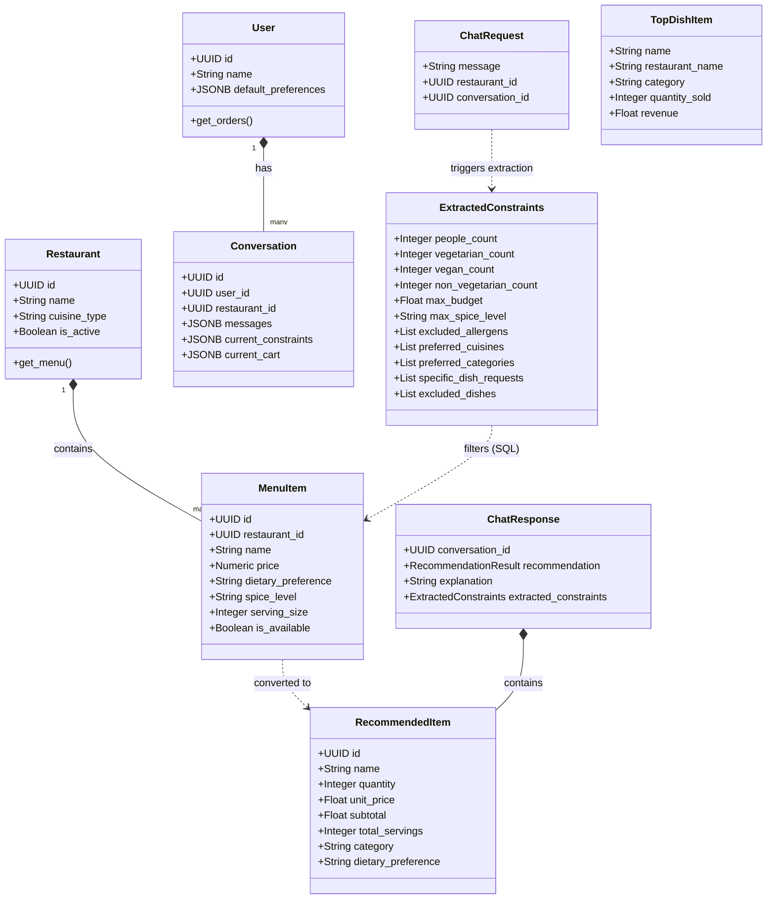
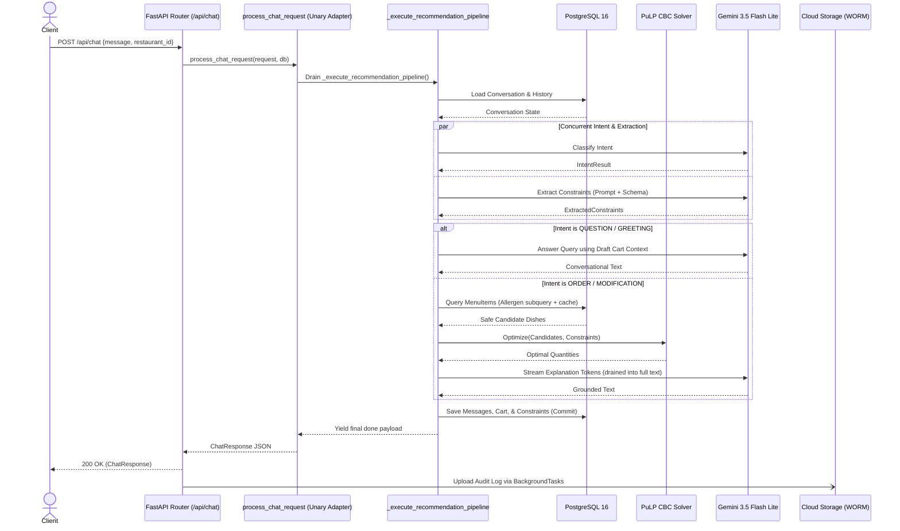
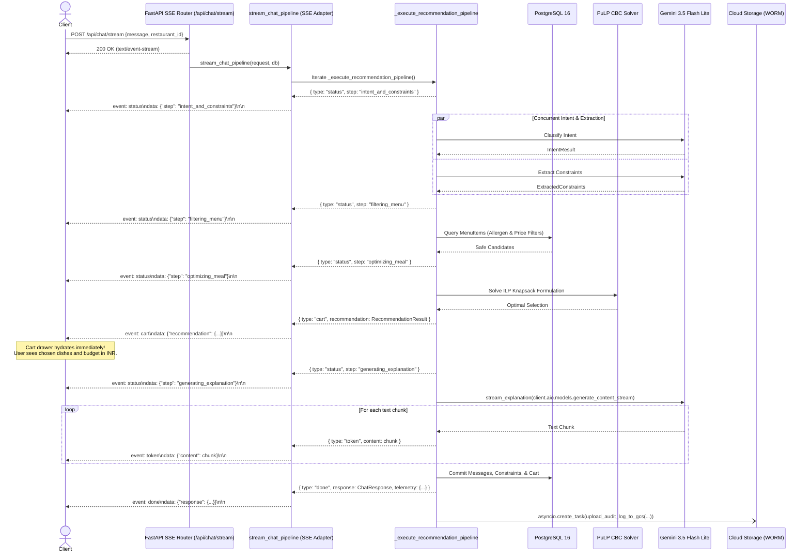

# SmartDiner UML Diagrams

While the ER Diagram covers the relational database structure, these UML Class and Sequence diagrams illustrate the object-oriented structure of the Python backend (SQLAlchemy Models and Pydantic Schemas), the Generator-First streaming architecture, and the execution flows for both REST and Server-Sent Events (SSE).

## 1. Overall System Architecture & Separation of Concerns

This flowchart outlines the high-level architecture of the Governed Recommendation Pipeline. Note how the **Gemini 3.5 Flash Lite** model is specifically orchestrated across independent tasks (Intent Classification, Constraint Extraction, Question Answering, and Explanation).

The recommendation engine adopts a **Generator-First Architecture**: `_execute_recommendation_pipeline` serves as the canonical async generator. `stream_chat_pipeline` yields SSE text frames to `POST /api/chat/stream`, while `process_chat_request` drains the generator in memory to assemble the JSON payload for `POST /api/chat`.

```mermaid
flowchart TD
    Client[Next.js Client] -->|POST /api/chat/stream (SSE)| SSEAPI[FastAPI SSE Router]
    Client -->|POST /api/chat (REST)| UnaryAPI[FastAPI REST Router]
    
    SSEAPI --> StreamAdapter[stream_chat_pipeline<br/>SSE Text Formatter]
    UnaryAPI --> UnaryAdapter[process_chat_request<br/>In-Memory Drain Adapter]
    
    StreamAdapter --> CoreGen[_execute_recommendation_pipeline<br/>Canonical Async Generator]
    UnaryAdapter --> CoreGen
    
    subgraph ModularPipeline [Decomposed Pipeline Stages]
        direction TB
        S1["1. _load_conversation_state<br/>(PostgreSQL JSONB)"]
        S2["2. _resolve_restaurant_context<br/>(Alias matching, venue switching, reset)"]
        S3["3. Concurrent Intent & Extraction<br/>(Gemini 3.5 Flash Lite)"]
        S4["4. _handle_non_recommendation_intent<br/>(QUESTION / GREETING / OFF_TOPIC short-circuit)"]
        S5["5. SQL Menu Filter<br/>(L1 / L2 Cache + Allergen subquery)"]
        S6["6. PuLP ILP Solver<br/>(Deterministic Knapsack Optimization)"]
        S7["7. _build_recommendation_result<br/>(Typed items & dietary counts)"]
        S8["8. LLM Explanation Streamer<br/>(stream_explanation generator)"]
        S9["9. _save_conversation_state<br/>(Commit to DB)"]
        S10["10. _dispatch_gcs_audit<br/>(Async GCS WORM Upload)"]
        
        S1 --> S2 --> S3 --> S4
        S4 -->|ORDER / MODIFICATION| S5 --> S6 --> S7 --> S8 --> S9 --> S10
        S4 -->|QUESTION / GREETING| S9 --> S10
    end
    
    CoreGen --> ModularPipeline
    CoreGen -.->|event: status / cart / token / done| StreamAdapter
    CoreGen -.->|yields chunks| UnaryAdapter
```

## 2. Class Diagram (Core Backend Models & Schemas)

This diagram shows how the FastAPI Pydantic schemas (for data validation) map and relate to internal SQLAlchemy ORM models.



## 3. Sequence Diagram (Unary REST Execution Flow: `POST /api/chat`)

This sequence diagram illustrates the unary HTTP request flow via `process_chat_request`, which drains the canonical generator in memory and returns a complete `ChatResponse` JSON payload.



## 4. Sequence Diagram (Server-Sent Events Streaming Flow: `POST /api/chat/stream`)

This sequence diagram illustrates real-time event streaming via `stream_chat_pipeline`. The user receives phase status updates, and crucially, the **verified cart is rendered immediately upon ILP completion** before explanation tokens stream chunk-by-chunk.


